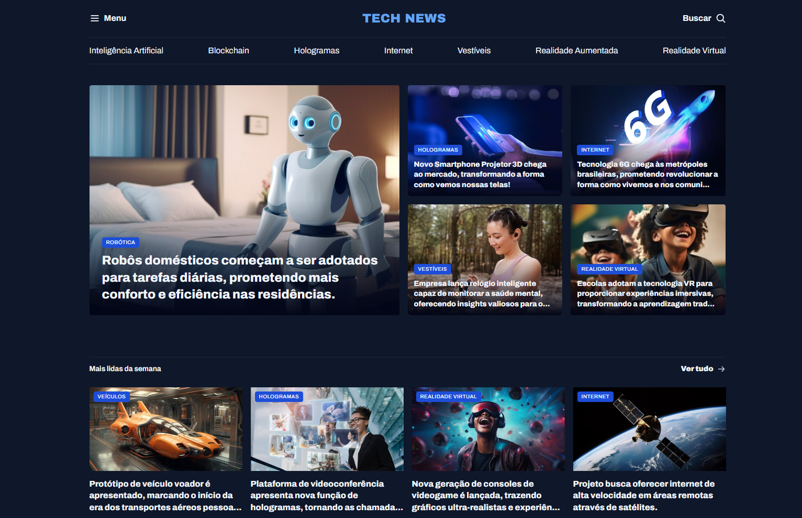

# 📰 Portal de Notícias: Tech News

> Projeto desenvolvido durante a **formação FullStack da Rocketseat**, sob mentoria do **professor Mayk Brito**.
> Desafio prático da trilha **HTML e CSS**.

---

## 🧭 Sobre o projeto

O Tech News é um portal de notícias de tecnologia, com foco em temas como Inteligência Artificial, Blockchain, Hologramas, Internet, Vestíveis, Realidade Aumentada e Realidade Virtual.
O layout foi construído com **HTML semântico e CSS Grid**, aplicando o conceito **utility-first** para facilitar a reutilização de classes.

A ideia foi criar uma interface moderna, acessível e organizada, simulando um portal real de tecnologia, com destaque para manchetes e seções temáticas.

---

## 🛠️ Tecnologias utilizadas

* **HTML5**
* **CSS (Grid, Flex e Nesting)**
* **GitHub**

---

## 🚀 Aprendizados

Durante o desenvolvimento, foram aplicados conceitos importantes como:

- Uso de tags semânticas (`header`, `main`, `section`, `article`, `figure`, `figcaption`);

- Organização de layout com **Grid** e **Flexbox**;

- Estilização responsiva com **utility classes**;

- Aplicação prática de propriedades como `gap`, `align-items`, `grid-template-columns`, `nth-child` e `place-items`.

Esse projeto consolidou fundamentos essenciais de estrutura e estilo, servindo como base sólida pra projetos front-end mais complexos.

---

Feito com 💜 durante o curso da [Rocketseat](https://www.rocketseat.com.br)
👨‍🏫 Mentoria: [Mayk Brito](https://github.com/maykbrito)
👩🏼‍💻 Estudante: [Luciene Freitas](https://github.com/LucieneFreitas)

